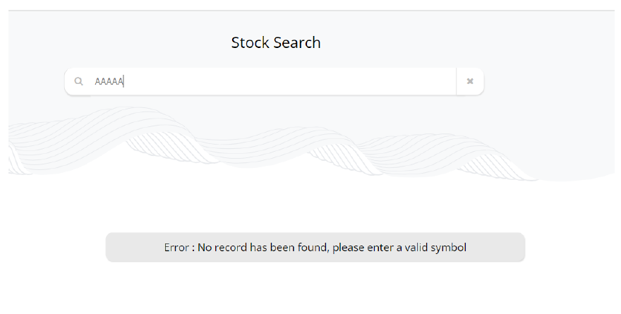
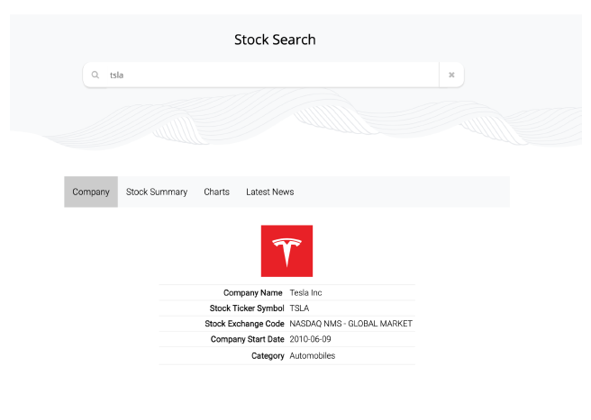
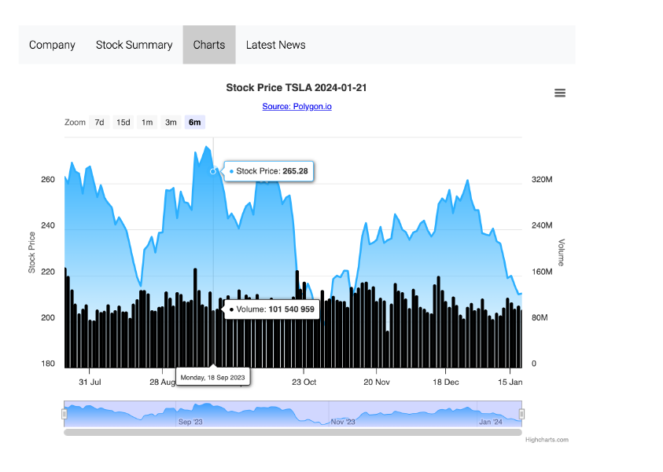
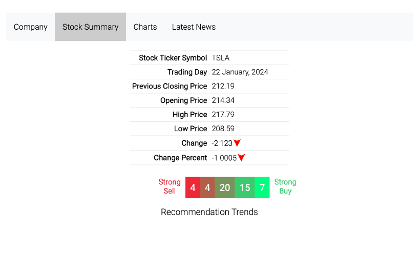
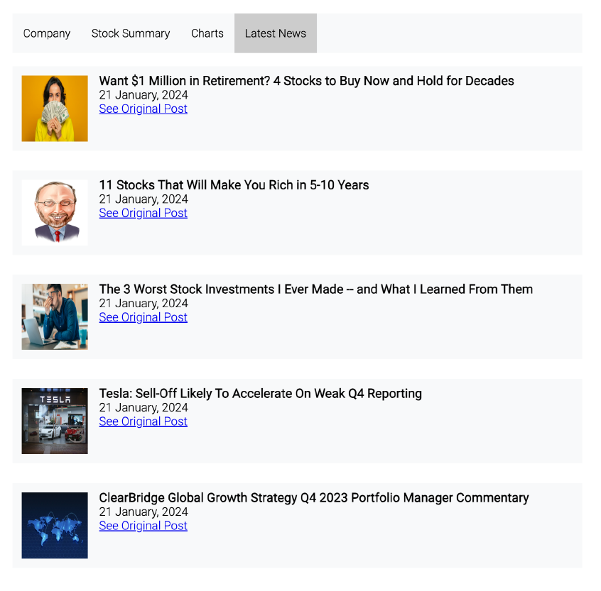

# Stock Search and Trade Web Application Projects

Welcome to the repository showcasing three web application projects created as part of the CSCI 571 (Web Technologies) course at the University of Southern California. These projects are focused on providing users with a comprehensive platform to search for stock information, view stock charts, and read related news articles.

## Project 1: Stock Search and Trade Web App

### Objective

The objective of this project was to gain experience with Python, Flask framework, HTML, CSS, JavaScript, DOM manipulation, JSON, and APIs, and hands-on experience with the Google Cloud Platform.

### Description

This project allows users to search for stock information using Python Flask, JSON, and data obtained from Finnhub Stock API and Polygon.IO. Users can view stock details, including tabular data and interactive charts.

#### Features

- **Search Form:** Users can search for stock ticker symbols.
- **Displaying Results:** Results are displayed in tabs including Company, Stock Summary, Charts, and Latest News.

#### Technologies Used

Python Flask, Finnhub Stock API, JSON, HighCharts.

#### Screenshots

    
    
    
    
    

## Project 2: Full stack Stock Search and Trade App with MEAN Stack

### Objective

The objective of this project was to learn to use Angular framework, ng-bootstrap library, and MongoDB Atlas database.

### Description

This project implements a responsive web app using Angular, Bootstrap, and MongoDB Atlas for storing stock data. Users can search for stock symbols, view detailed stock information, and save favorites.

#### Features

- **Responsive Design:** Utilizes Bootstrap Grid System and Google's Material UI library for responsiveness.
- **Stock Details:** Detailed information about stocks including charts, news, and company insights.
- **Favorites and Portfolio Section:** Users can mark stocks as favorites, and also trade stocks.

#### Technologies Used

Angular, Bootstrap, MongoDB Atlas, ng-bootstrap, highcharts-angular.

#### Screenshots

    
    
    
    
    
    
    
    
    
    
    
    

## Project 3: Android Stock Trading App

### Objective

The objective of this project was to develop an Android app for stock trading and information using the same backend as Project 2.

### Description

This Android app provides users with a platform to trade stocks, view portfolio, favorites, and detailed stock information. It fetches data using Volley and displays charts using HighCharts.

#### Features

- **Portfolio and Favorites:** Displays user's portfolio and favorited stocks.
- **Detailed Stock Information:** Detailed information about selected stocks including news, insights, and social sentiments.
- **Trade Dialog:** Allows users to buy or sell shares.

#### Technologies Used

Java, Android Studio, Volley, Picasso/Glide, HighCharts.

#### Screenshots

    
    
    
    
    
    
    
    

### Disclaimer

- The repository serves as a landing page showcasing the work done in the CSCI 571 course.
- Source code is not publicly available following academic integrity guidelines, but a private demo can be provided upon request.

Feel free to request a private demo for any of these projects to explore further.
